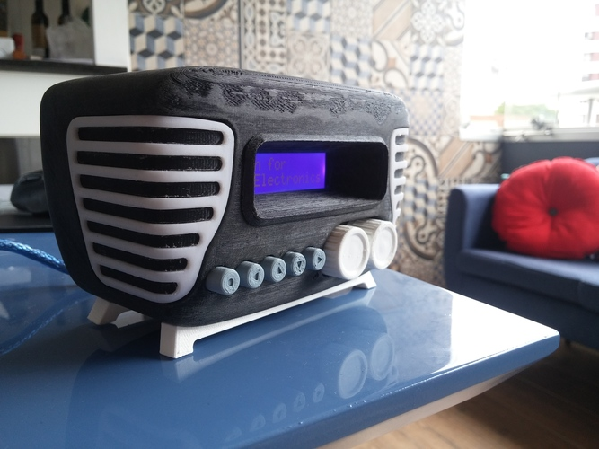

# Mini-Vintage-Internet-Radio

Designed by  
Guilherme Schallenbach

From  https://pinshape.com/items/27106-3d-printed-mini-vintage-internet-radio

based on

https://www.hackster.io/akellyirl/arduino-raspberry-pi-internet-radio-034262

license:

CC - Attribution - Non-Commercial - Share Alike

https://creativecommons.org/licenses/by-nc-sa/4.0/

https://help.github.com/en/github/managing-files-in-a-repository/3d-file-viewer
